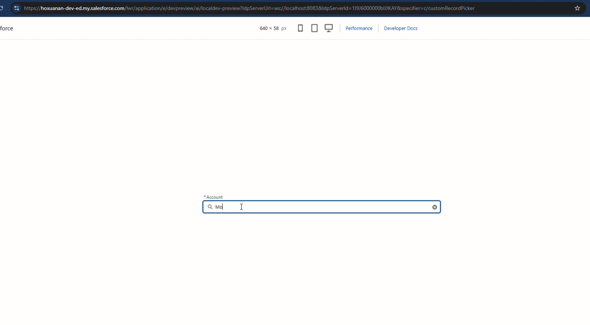

# customRecordPicker

[](LICENSE)
[](https://developer.salesforce.com/docs/platform/graphql/guide)
[](https://developer.salesforce.com/docs/component-library)

A configurable Lightning Web Component (LWC) that replicates the native `lightning-record-picker` experience, with extended capabilities:

- **Display profiles** — show different subtitle fields depending on a discriminator field (e.g. `IsPersonAccount`)
- **Flexible filter system** — supports filter criteria, `filterLogic` expressions (`AND`, `OR`, `NOT`, parentheses), and Salesforce date literals (`TODAY`, `LAST_MONTH`, `NEXT_YEAR`, …)
- **Multi-field search** — search across multiple fields simultaneously (String, Picklist)
- **Relationship fields** — traverse lookup fields (`Owner.Name`, `RecordType.DeveloperName`)
- **Flow-compatible** — fires `FlowAttributeChangeEvent` when `useFlow = true`
- **Keyboard navigation** — ArrowUp / ArrowDown / Enter / Escape
- **Validation API** — `validate()` / `reportValidity()` compatible with Flow screen validation

---

## Demo

The demo below shows the component configured for **Account search with display profiles** — searching across personal accounts (`Personal_Account` record type) and business accounts (`B2C` record type). Each type displays different subtitle fields based on the `RecordType.DeveloperName` discriminator.



### Demo scenario — Account search with discriminator

**What is shown:**
- Typing in the search bar triggers a GraphQL search on `Account.Name`
- Results appear in a dropdown below the search bar
- **Personal accounts** (`Personal_Account`) show: ID Salesforce · Identifiant (`PersonIdentifiant__c`) · Source
- **Business accounts** (`B2C`) show: ID Salesforce · Identifiant (`CompanyIdentifiant__c`) · Source
- Selecting a record collapses the input into a pill showing the name and the correct subtitle for that account type
- The clear button resets the picker back to the search state

**Config used in this demo:**

```json
{
  "label": "Tiers payeurs",
  "objectApiName": "Account",
  "titleField": "Name",
  "searchFields": [
    { "apiName": "Name" }
  ],
  "iconName": "standard:account",
  "discriminator": "RecordType.DeveloperName",
  "displayProfiles": {
    "Personal_Account": {
      "subtitleFields": [
        { "apiName": "Id",                              "fieldLabel": "ID Salesforce" },
        { "apiName": "hoxuana_a__PersonIdentifiant__c", "fieldLabel": "Identifiant" },
        { "apiName": "AccountSource",                   "fieldLabel": "Source" }
      ]
    },
    "B2C": {
      "subtitleFields": [
        { "apiName": "Id",                               "fieldLabel": "ID Salesforce" },
        { "apiName": "hoxuana_a__CompanyIdentifiant__c", "fieldLabel": "Identifiant" },
        { "apiName": "AccountSource",                    "fieldLabel": "Source" }
      ]
    }
  },
  "placeholder": "Rechercher un compte…",
  "required": true,
  "maxResults": 20,
  "minimumSearchLength": 2
}
```

> **Note on `discriminator`:** The demo uses `RecordType.DeveloperName` (a relationship field) instead of `IsPersonAccount` because the Person Accounts feature is not enabled on the demo org. The behavior is identical — the component reads the discriminator field value from each result node and selects the matching `displayProfiles` key (`"Personal_Account"` or `"B2C"`).

---

## Component files

```
lwc/customRecordPicker/
├── customRecordPicker.html
├── customRecordPicker.js
├── customRecordPicker.css
├── customRecordPicker.js-meta.xml
├── customRecordPickerUtils.js          ← pure helper functions
└── __tests__/
    ├── customRecordPicker.test.js      ← component integration tests
    └── customRecordPickerUtils.test.js ← unit tests for pure functions
```

---

## Public API (`@api`)

| Property | Type | Default | Description |
|---|---|---|---|
| `config` | `Object \| String` | — | Configuration object (or JSON string). See full reference below. **Required.** |
| `selectedRecordId` | `String` | — | The ID of the currently selected record. Readable and writable. |
| `disabled` | `Boolean` | `false` | Disables the picker. |
| `width` | `String` | `"640px"` | Host element width. Accepts `px`, `rem`, `em`, `%`, `vw`, `vh`, `auto`. |
| `useFlow` | `Boolean` | `false` | When `true`, fires `FlowAttributeChangeEvent` on selection change. |
| `isSelected` | `Boolean` | `false` | Read-only. `true` when a record is selected and its data is loaded. |
| `hasError` | `Boolean` | `false` | Read-only. `true` when a config error, validation error, or query error is active. |

### Methods

| Method | Returns | Description |
|---|---|---|
| `validate()` | `{ isValid: Boolean, errorMessage?: String }` | Checks required field and config validity. |
| `reportValidity()` | `Boolean` | Shorthand for `validate().isValid`. |
| `clearSelection()` | `void` | Programmatically resets the selection and all internal state. |

### Events

| Event | `detail` | Fired when |
|---|---|---|
| `change` | `{ recordId: String \| null }` | A record is selected, or the selection is cleared. |

---

## `config` property — full reference

The `config` property accepts either a JavaScript object or a JSON string.

```jsonc
{
  // ── Required ───────────────────────────────────────────────────────────────

  "objectApiName": "Account",           // Salesforce API name of the object to search

  "searchFields": [                     // Fields used to build the search WHERE clause
    { "apiName": "Name" },              // String field (default) — uses LIKE operator
    { "apiName": "AccountSource",
      "dataType": "Picklist" }          // Picklist — uses eq operator (exact match)
  ],

  // ── Display ────────────────────────────────────────────────────────────────

  "label": "Search account",           // Input label (default: "Rechercher un enregistrement")
  "placeholder": "Type to search…",    // Input placeholder
  "titleField": "Name",                // Field shown as the main title in results + pill
                                        // (default: "Name")

  "subtitleFields": [                   // Fields shown as subtitle in results + pill
    { "apiName": "BillingCity",         // Field API name (supports relationship: "Owner.Name")
      "fieldLabel": "City" }            // Label shown before the value: "City : Paris"
  ],

  "iconName": "standard:account",      // SLDS icon shown next to each result

  // ── Behaviour ──────────────────────────────────────────────────────────────

  "required": false,                    // Makes the field required for validate()
  "maxResults": 10,                     // Max results returned (capped at 100)
  "minimumSearchLength": 2,            // Minimum characters before triggering search

  // ── Filter ─────────────────────────────────────────────────────────────────

  "filter": {
    "criteria": [ /* see filter reference below */ ],
    "filterLogic": "1 AND 2"            // Optional. Defaults to AND of all criteria.
  },

  // ── Display profiles (discriminator) ──────────────────────────────────────

  "discriminator": "IsPersonAccount",  // Field used to choose the display profile
  "displayProfiles": {                  // Key must match the string value of the discriminator field
    "true":  { "subtitleFields": [ … ] },
    "false": { "subtitleFields": [ … ] }
  }
}
```

---

## Config attributes — detailed reference

### `objectApiName`

| | |
|---|---|
| **Type** | `String` |
| **Required** | Yes |
| **Default** | — |
| **Description** | The Salesforce API name of the object to search. Must start with a letter and contain only alphanumeric characters and underscores. Custom objects must end with `__c`. |
| **Examples** | `"Account"`, `"Contact"`, `"Opportunity"`, `"MyCustomObject__c"` |

---

### `searchFields`

| | |
|---|---|
| **Type** | `Array<{ apiName: String, dataType?: String }>` |
| **Required** | Yes |
| **Default** | — |
| **Description** | List of fields used to build the `WHERE` clause. Each entry is an object with at minimum an `apiName`. The component generates an `OR` condition across all search fields, so a result matches if _any_ field matches the search term. |

#### `searchFields[].apiName`

| | |
|---|---|
| **Type** | `String` |
| **Required** | Yes |
| **Description** | Field API name. Supports simple fields (`Name`, `Phone`) and relationship traversal (`RecordType.DeveloperName`). Custom fields must end with `__c`. |

#### `searchFields[].dataType`

| | |
|---|---|
| **Type** | `String` |
| **Required** | No |
| **Default** | `"String"` |
| **Allowed values** | `"String"`, `"Picklist"` |
| **Description** | Data type of the field. `"String"` generates a `LIKE '%...%'` condition. `"Picklist"` generates an `eq` (exact match) condition. Use `"Picklist"` for fields that are actual Picklist type in Salesforce, or for any field where partial matching is not desired. |

**Example:**
```json
"searchFields": [
  { "apiName": "Name" },
  { "apiName": "Phone" },
  { "apiName": "AccountSource", "dataType": "Picklist" }
]
```

---

### `label`

| | |
|---|---|
| **Type** | `String` |
| **Required** | No |
| **Default** | `"Rechercher un enregistrement"` |
| **Description** | Text label displayed above the search input. |
| **Example** | `"Search Account"` |

---

### `placeholder`

| | |
|---|---|
| **Type** | `String` |
| **Required** | No |
| **Default** | `""` (empty) |
| **Description** | Placeholder text displayed inside the search input when it is empty. |
| **Example** | `"Type a name or phone number…"` |

---

### `titleField`

| | |
|---|---|
| **Type** | `String` |
| **Required** | No |
| **Default** | `"Name"` |
| **Description** | Field API name whose value is displayed as the primary title in each search result row and in the selected-record pill. Supports relationship traversal (e.g. `"Account.Name"`). |
| **Constraints** | Must be a valid field path (letters, digits, underscores, dots for relationships). |
| **Examples** | `"Name"`, `"Subject"`, `"CaseNumber"` |

---

### `subtitleFields`

| | |
|---|---|
| **Type** | `Array<{ apiName: String, fieldLabel: String }>` |
| **Required** | No |
| **Default** | `[]` (no subtitle) |
| **Description** | Fields displayed as a secondary line below the title in each result row and in the selected-record pill. Each field is rendered as `"fieldLabel : value"`. Multiple fields are joined with ` · `. Supports relationship traversal. |
| **Note** | Overridden by `displayProfiles[key].subtitleFields` when `discriminator` is set and a matching profile exists. |

#### `subtitleFields[].apiName`

| | |
|---|---|
| **Type** | `String` |
| **Required** | Yes |
| **Description** | Field API name. Supports relationship traversal: `"Owner.Name"`, `"Owner.Profile.Name"`. Use `"Id"` to display the Salesforce record ID. |

#### `subtitleFields[].fieldLabel`

| | |
|---|---|
| **Type** | `String` |
| **Required** | Yes |
| **Description** | Human-readable label displayed before the field value: `"fieldLabel : value"`. |

**Example:**
```json
"subtitleFields": [
  { "apiName": "BillingCity",   "fieldLabel": "City"   },
  { "apiName": "AccountNumber", "fieldLabel": "Ref"    },
  { "apiName": "Owner.Name",    "fieldLabel": "Owner"  }
]
```

---

### `iconName`

| | |
|---|---|
| **Type** | `String` |
| **Required** | No |
| **Default** | `""` (no icon) |
| **Description** | SLDS icon name used in search result rows. Follows the `category:name` format of `lightning-icon`. |
| **Examples** | `"standard:account"`, `"standard:contact"`, `"standard:opportunity"`, `"custom:custom1"` |
| **Reference** | [SLDS Icon Library](https://www.lightningdesignsystem.com/icons/) |

---

### `required`

| | |
|---|---|
| **Type** | `Boolean` |
| **Required** | No |
| **Default** | `false` |
| **Description** | When `true`, `validate()` returns `isValid: false` if no record is selected. Used in Flow screen validation or custom form validation. An asterisk is shown on the label when required. |

---

### `maxResults`

| | |
|---|---|
| **Type** | `Integer` |
| **Required** | No |
| **Default** | `10` |
| **Constraints** | Capped at `100` (Salesforce GraphQL limit). Values above 100 are silently clamped to 100. |
| **Description** | Maximum number of records to display in the dropdown. |

---

### `minimumSearchLength`

| | |
|---|---|
| **Type** | `Integer` |
| **Required** | No |
| **Default** | `2` |
| **Constraints** | Must be ≥ 1. |
| **Description** | Minimum number of characters the user must type before the component fires a search query. Useful to avoid overly broad queries on large objects. |

---

### `filter`

| | |
|---|---|
| **Type** | `Object` |
| **Required** | No |
| **Default** | `undefined` (no filter) |
| **Description** | Static filter applied to every search query in addition to the user's search term. The filter is appended to the GraphQL `WHERE` clause. |

#### `filter.criteria`

| | |
|---|---|
| **Type** | `Array<Criterion>` |
| **Required** | Yes (when `filter` is provided) |
| **Description** | Array of filter conditions. Each criterion is an object with `fieldPath`, `operator`, and `value`. |

**Criterion shape:**

```jsonc
{
  "fieldPath": "Type",         // Field to filter on (supports relationship fields)
  "operator": "eq",            // One of: eq ne like gt gte lt lte in nin
  "value": "Customer - Direct" // See value types below
}
```

**`fieldPath`** — Field API name. Supports relationship traversal (`Owner.IsActive`, `RecordType.DeveloperName`).

**`operator`** — One of:

| Operator | Meaning | Notes |
|---|---|---|
| `eq` | Equal to | |
| `ne` | Not equal to | |
| `like` | Pattern match | Use `%` and `_` as wildcards |
| `gt` | Greater than | |
| `gte` | Greater than or equal | |
| `lt` | Less than | |
| `lte` | Less than or equal | |
| `in` | Value is in array | `value` must be an array |
| `nin` | Value is not in array | `value` must be an array |

**`value`** — Supported types:

| Type | Example | Notes |
|---|---|---|
| `String` | `"Customer"` | |
| Salesforce ID (15 or 18 chars) | `"001xx000003GHPY"` | Sent as GraphQL `ID` type |
| `Integer` | `42` | |
| `Float` | `3.14` | |
| `Boolean` | `true` | |
| Date literal | `{ "literal": "TODAY" }` | Inlined in query, not a variable |
| `null` | `null` | |
| Array | `["A", "B"]` | Required for `in` / `nin` operators |

#### `filter.filterLogic`

| | |
|---|---|
| **Type** | `String` |
| **Required** | No |
| **Default** | All criteria combined with `AND` |
| **Description** | Expression that controls how `filter.criteria` are combined. Uses 1-based criterion index numbers, `AND`, `OR`, `NOT`, and parentheses. |

**Syntax:**
```
"1 AND 2"
"1 OR 2"
"(1 OR 2) AND 3"
"NOT 1"
"(1 AND 2) OR (3 AND NOT 4)"
```

**Example — filter with logic:**
```json
"filter": {
  "criteria": [
    { "fieldPath": "CreatedDate", "operator": "gte", "value": { "literal": "LAST_90_DAYS" } },
    { "fieldPath": "Type",        "operator": "eq",  "value": "Customer - Direct"          },
    { "fieldPath": "Type",        "operator": "eq",  "value": "Partner"                    }
  ],
  "filterLogic": "1 AND (2 OR 3)"
}
```

---

### Supported date literals

Any literal from the [Salesforce GraphQL literal values list](https://developer.salesforce.com/docs/platform/graphql/guide/date-literals.html):

`TODAY` · `YESTERDAY` · `TOMORROW` · `LAST_WEEK` · `THIS_WEEK` · `NEXT_WEEK` · `LAST_MONTH` · `THIS_MONTH` · `NEXT_MONTH` · `LAST_90_DAYS` · `NEXT_90_DAYS` · `THIS_YEAR` · `LAST_YEAR` · `NEXT_YEAR` · `LAST_N_DAYS:n` · `NEXT_N_DAYS:n` · etc.

---

### `discriminator`

| | |
|---|---|
| **Type** | `String` |
| **Required** | Required when `displayProfiles` is set |
| **Default** | `undefined` |
| **Description** | Field API name whose value is used to select which display profile to apply for each result row and selected-record pill. The field's value is read from the search result node and matched (as a string) against the keys of `displayProfiles`. |
| **Supports relationships** | Yes — e.g. `"RecordType.DeveloperName"` |
| **Constraints** | Automatically added to the query's field list by the component. |
| **Examples** | `"IsPersonAccount"`, `"RecordType.DeveloperName"`, `"Type"` |

> **Important:** The discriminator field value is always compared as a **string**. Boolean fields must use `"true"` / `"false"` as keys in `displayProfiles`, not `true` / `false`.

---

### `displayProfiles`

| | |
|---|---|
| **Type** | `Object<String, { subtitleFields: Array }>` |
| **Required** | Required when `discriminator` is set |
| **Default** | `undefined` |
| **Description** | Map from discriminator field values (as strings) to display configuration. When a search result's discriminator value matches a key, that profile's `subtitleFields` are used instead of the top-level `subtitleFields`. If no profile matches, falls back to top-level `subtitleFields` (or no subtitle if not defined). |

**Each profile value shape:**

```jsonc
{
  "subtitleFields": [
    { "apiName": "...", "fieldLabel": "..." }
  ]
}
```

The `subtitleFields` array within a profile follows the same rules as the top-level [`subtitleFields`](#subtitlefields) attribute.

**Example:**
```json
"discriminator": "IsPersonAccount",
"displayProfiles": {
  "true": {
    "subtitleFields": [
      { "apiName": "LastName",        "fieldLabel": "Last name" },
      { "apiName": "PersonNumber__c", "fieldLabel": "Person #"  }
    ]
  },
  "false": {
    "subtitleFields": [
      { "apiName": "AccountNumber",  "fieldLabel": "Account #" },
      { "apiName": "SIRETnumber__c", "fieldLabel": "SIRET"     }
    ]
  }
}
```

---

## Usage scenarios

### Scenario 1 — Minimal: search Contacts by name

```json
{
  "label": "Contact",
  "objectApiName": "Contact",
  "titleField": "Name",
  "searchFields": [{ "apiName": "Name" }]
}
```

### Scenario 2 — Multi-field search with subtitle

Search Accounts by name **or** phone number, show billing city as subtitle.

```json
{
  "label": "Account",
  "objectApiName": "Account",
  "titleField": "Name",
  "searchFields": [
    { "apiName": "Name" },
    { "apiName": "Phone" }
  ],
  "subtitleFields": [
    { "apiName": "BillingCity", "fieldLabel": "City" },
    { "apiName": "AccountNumber", "fieldLabel": "Ref" }
  ],
  "iconName": "standard:account",
  "placeholder": "Search by name or phone…",
  "maxResults": 20
}
```

### Scenario 3 — Filter with a static value

Only show Accounts of type `"Customer - Direct"`.

```json
{
  "label": "Customer",
  "objectApiName": "Account",
  "titleField": "Name",
  "searchFields": [{ "apiName": "Name" }],
  "filter": {
    "criteria": [
      {
        "fieldPath": "Type",
        "operator": "eq",
        "value": "Customer - Direct"
      }
    ]
  }
}
```

### Scenario 4 — Filter with a date literal

Only show records modified before today.

```json
{
  "label": "Account",
  "objectApiName": "Account",
  "titleField": "Name",
  "searchFields": [{ "apiName": "Name" }],
  "filter": {
    "criteria": [
      {
        "fieldPath": "LastModifiedDate",
        "operator": "lt",
        "value": { "literal": "TODAY" }
      }
    ]
  }
}
```

### Scenario 5 — Multiple criteria with filterLogic

Show Accounts created in the last 90 days, of type Customer OR Partner.

```json
{
  "label": "Recent account",
  "objectApiName": "Account",
  "titleField": "Name",
  "searchFields": [{ "apiName": "Name" }],
  "filter": {
    "criteria": [
      {
        "fieldPath": "CreatedDate",
        "operator": "gte",
        "value": { "literal": "LAST_90_DAYS" }
      },
      {
        "fieldPath": "Type",
        "operator": "eq",
        "value": "Customer - Direct"
      },
      {
        "fieldPath": "Type",
        "operator": "eq",
        "value": "Partner"
      }
    ],
    "filterLogic": "1 AND (2 OR 3)"
  }
}
```

### Scenario 6 — Discriminator / display profiles

Show different subtitle fields depending on whether the Account is a person account.

- **Person account** (`IsPersonAccount = true`): show last name + person number
- **Business account** (`IsPersonAccount = false`): show account number + SIRET

```json
{
  "label": "Tiers payeurs",
  "objectApiName": "Account",
  "titleField": "Name",
  "searchFields": [
    { "apiName": "Name" },
    { "apiName": "AccountSource", "dataType": "Picklist" }
  ],
  "iconName": "standard:account",
  "discriminator": "IsPersonAccount",
  "displayProfiles": {
    "true": {
      "subtitleFields": [
        { "apiName": "LastName",        "fieldLabel": "Nom" },
        { "apiName": "PersonNumber__c", "fieldLabel": "N° de personne" }
      ]
    },
    "false": {
      "subtitleFields": [
        { "apiName": "AccountNumber",   "fieldLabel": "N° de compte" },
        { "apiName": "SIRETnumber__c",  "fieldLabel": "SIRET" }
      ]
    }
  },
  "placeholder": "Rechercher tiers payeur",
  "required": true,
  "maxResults": 50,
  "minimumSearchLength": 2
}
```

### Scenario 7 — Relationship fields

Show the record owner's name and profile as subtitle.

```json
{
  "label": "Opportunity",
  "objectApiName": "Opportunity",
  "titleField": "Name",
  "searchFields": [{ "apiName": "Name" }],
  "subtitleFields": [
    { "apiName": "Owner.Name",         "fieldLabel": "Owner" },
    { "apiName": "Owner.Profile.Name", "fieldLabel": "Profile" },
    { "apiName": "StageName",          "fieldLabel": "Stage" }
  ],
  "iconName": "standard:opportunity"
}
```

### Scenario 8 — Filter by related record ID

Show only Contacts belonging to a specific Account.

```json
{
  "label": "Contact",
  "objectApiName": "Contact",
  "titleField": "Name",
  "searchFields": [{ "apiName": "Name" }],
  "subtitleFields": [
    { "apiName": "Title", "fieldLabel": "Title" }
  ],
  "filter": {
    "criteria": [
      {
        "fieldPath": "AccountId",
        "operator": "eq",
        "value": "001xx000003GHPYAA4"
      }
    ]
  }
}
```

### Scenario 9 — Using in a Flow screen

Set `useFlow = true`. The component fires `FlowAttributeChangeEvent` when the selection changes, allowing the Flow to capture `selectedRecordId` as an output variable.

**Flow screen property configuration:**

| Property | Value |
|---|---|
| `config` | JSON string of the config object |
| `useFlow` | `true` |
| `selectedRecordId` | output variable (e.g. `{!varSelectedId}`) |

### Scenario 10 — Programmatic usage in a parent LWC

```html
<!-- parent.html -->
<c-custom-record-picker
    config={pickerConfig}
    onchange={handlePickerChange}>
</c-custom-record-picker>
```

```js
// parent.js
import { LightningElement } from 'lwc';

export default class Parent extends LightningElement {
    pickerConfig = {
        label: 'Account',
        objectApiName: 'Account',
        titleField: 'Name',
        searchFields: [{ apiName: 'Name' }],
        required: true
    };

    handlePickerChange(event) {
        const { recordId } = event.detail;
        // recordId is null when the selection is cleared
        console.log('Selected:', recordId);
    }

    handleSubmit() {
        const picker = this.template.querySelector('c-custom-record-picker');
        const { isValid, errorMessage } = picker.validate();
        if (!isValid) {
            console.warn(errorMessage);
            return;
        }
        const recordId = picker.selectedRecordId;
        // proceed with recordId
    }
}
```

---

## Deployment

```bash
# Deploy to your default org
sf project deploy start --source-dir force-app

# Deploy to a specific org
sf project deploy start --source-dir force-app --target-org <alias>
```

---

## Running tests

```bash
npm install
npm test                  # run all tests once
npm run test:watch        # watch mode
npm run test:coverage     # with coverage report
```

The test suite covers:

- Config validation (objectApiName, searchFields, titleField, discriminator/displayProfiles, JSON parsing)
- Required field validation and selection state
- Display profiles (discriminator-based subtitle selection)
- GraphQL wire adapter results and error handling
- Filter building: literals, static values, AND/OR/NOT logic, multi-field search, Picklist
- Width property (valid/invalid values)
- Event dispatching (change, FlowAttributeChangeEvent, disabled state)
- Keyboard navigation (ArrowUp/Down/Enter/Escape)
- Error state (`hasError`)

---

## Limitations

- Requires **API version 66.0+** (GraphQL wire adapter)
- The `lightning/uiGraphQLApi` wire requires **Local Dev** or a connected org to resolve at runtime
- `displayProfiles` keys are matched by **string value** of the discriminator field — use `"true"` / `"false"` as keys, not `true` / `false`
- `in` and `nin` operators expect the value to be a JavaScript array

---

## Contributing

Contributions are welcome! Feel free to open an issue or submit a pull request.

1. Fork the repository
2. Create a feature branch: `git checkout -b feature/my-improvement`
3. Commit your changes: `git commit -m "Add my improvement"`
4. Push to the branch: `git push origin feature/my-improvement`
5. Open a Pull Request

Please make sure all tests pass before submitting:

```bash
npm test
```

---

## License

[MIT](LICENSE) — free to use, modify, and distribute.
